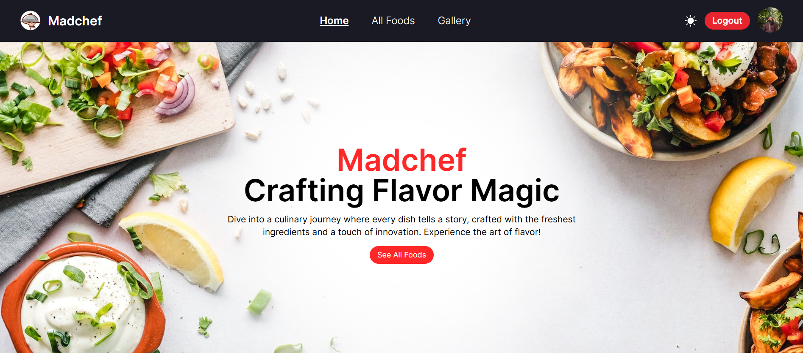

# Madchef

This project aims to develop a full-stack Restaurant Management website using the MERN Stack (MongoDB, Express.js, React.js, Node.js). The platform is designed to enhance both the customer and staff experience, with a user-friendly and engaging interface. Key features will focus on improving the restaurant's online presence, enabling seamless customer interaction, and streamlining internal management processes. The goal is to provide an efficient, scalable, and easy-to-manage solution for restaurant operations.

## Live Site

- [Firebase-1](https://madchef-1487d.web.app/)
- [Firebase-2](https://madchef-1487d.firebaseapp.com/)
- [Netlify](https://storied-halva-b354f3.netlify.app/)



## Technologies Used:

- **Frontend**:
  - React.js
  - React Router
  - Firebase Authentication
  - Tailwind CSS
  - Context API
  - JWT (for storing and sending tokens)

- **Backend**:
  - Express.js
  - MongoDB
  - JWT (for token verification)
  - CORS Middleware


## Key Features

- **User Authentication:** Login and Register with email/password or social logins (Google/GitHub).
- **Food Browsing:** Browse through available food items, including details such as price, quantity, and purchase count.
- **Food Purchase:** Buy food items based on availability, and track orders.
- **Gallery Section:** View and interact with food images in a gallery format.
- **My Foods (Private):** Add, update, and manage food items you’ve listed for sale.
- **My Orders (Private):** Track your orders and delete them if necessary.
- **Theme Toggling:** Light/dark theme customization based on user preference.
- **JWT Authentication:** Secure private routes with JSON Web Tokens for user verification.

## NPM Packages Used

- **React Router**: For routing and navigation within the app.
- **react-toastify**: For showing success and error toasts on user actions.
- **react-lightbox**: For the gallery lightbox functionality.
- **moment.js**: For formatting dates and times in human-readable format.

## Dependencies

This project uses the following dependencies:

- **@tanstack/react-query**: ^5.62.8
- **axios**: ^1.7.9
- **firebase**: ^11.1.0
- **firebase-tools**: ^13.29.1
- **moment**: ^2.30.1
- **react**: ^18.3.1
- **react-dom**: ^18.3.1
- **react-hot-toast**: ^2.4.1
- **react-icons**: ^5.4.0
- **react-router-dom**: ^7.1.0
- **swiper**: ^11.1.15
- **yet-another-react-lightbox**: ^3.21.7

## Local Setup

To run this project locally, follow the steps below:

1. Clone the repository:
    ```bash
    git clone https://github.com/your-username/your-repository-name.git
    ```

2. Navigate into the project directory:
    ```bash
    cd your-repository-name
    ```

3. Install dependencies:
   Make sure you have `Node.js` installed, then run:
    ```bash
    npm install
    ```

4. Set up Firebase (if needed):
   - Create a Firebase project at [Firebase Console](https://console.firebase.google.com/).
   - Set up Firebase Authentication and Firebase Hosting.
   - Add your Firebase configuration in the `.env` file.

5. Start the development server:
    ```bash
    npm start
    ```

6. Open the project in your browser:
   Go to `http://localhost:3000` in your browser to see the project running.

Make sure to replace `your-username/your-repository-name` with your actual GitHub username and repository name.

