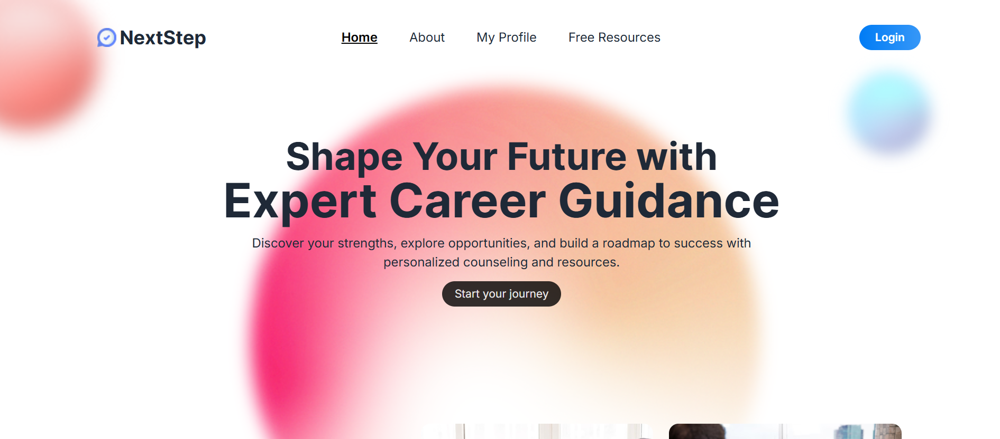

### Assignment-09-004
# NextStep

NextStep is a career counseling platform offering personalized services like one-on-one counseling, resume reviews, and actionable feedback. With secure user authentication, protected routes, and a modern, responsive design, it ensures a smooth experience across all devices. Features like real-time progress tracking and interactive tools empower users to make informed career decisions. Built with advanced technologies, NextStep provides a seamless and engaging experience, making career development easier and more effective.

## Live Demo

- [Firebase-1](https://nextstep-5556e.web.app/)
- [Firebase-2](https://nextstep-5556e.firebaseapp.com/)
- [Netlify](https://thriving-starlight-762625.netlify.app/)



## Technologies Used:

- **React.js**: Frontend JavaScript library for building user interfaces.
- **React Router**: For handling routing and navigation in the app.
- **Firebase**: For user authentication, database, and hosting.


## ✨ Features and Characteristics

1. **Personalized Career Services**  
   Includes one-on-one counseling, resume reviews, and actionable feedback, providing tailored solutions to help users make informed career decisions.

2. **Secure User Authentication**  
   Protects user data with advanced authentication features and ensures safe access to all platform functionalities through protected routes.

3. **Responsive Design**  
   Delivers a seamless browsing experience across desktops, tablets, and smartphones, making it convenient for users on the go.

4. **Interactive Tools**  
   Offers engaging features like feedback forms, progress trackers, and dynamic content updates to enhance user engagement and utility.

5. **Seamless Navigation**  
   Boasts an intuitive design with well-organized sections and easy-to-use features, ensuring quick access to all services.

6. **Comprehensive Career Resources**  
   Provides access to guides, tips, and resources to help users prepare for interviews, build skills, and succeed in their chosen fields.


## Dependencies:

The following dependencies are used in this project:

- firebase: ^11.0.2
- firebase-tools: ^13.25.0
- react: ^18.3.1
- react-dom: ^18.3.1
- react-helmet: ^6.1.0
- react-helmet-async: ^2.0.5
- react-icons: ^5.3.0
- react-router-dom: ^6.28.0
- react-scroll: ^1.9.0
- react-toastify: ^10.0.6
- swiper: ^11.1.14

## Local Setup

To run this project locally, follow the steps below:

1. Clone the repository:
    ```bash
    git clone https://github.com/your-username/your-repository-name.git
    ```

2. Navigate into the project directory:
    ```bash
    cd your-repository-name
    ```

3. Install dependencies:
   Make sure you have `Node.js` installed, then run:
    ```bash
    npm install
    ```

4. Set up Firebase (if needed):
   - Create a Firebase project at [Firebase Console](https://console.firebase.google.com/).
   - Set up Firebase Authentication and Firebase Hosting.
   - Add your Firebase configuration in the `.env` file.

5. Start the development server:
    ```bash
    npm start
    ```

6. Open the project in your browser:
   Go to `http://localhost:3000` in your browser to see the project running.

Make sure to replace `your-username/your-repository-name` with your actual GitHub username and repository name.

