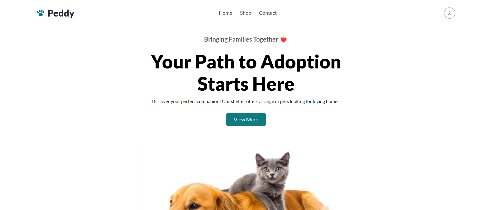
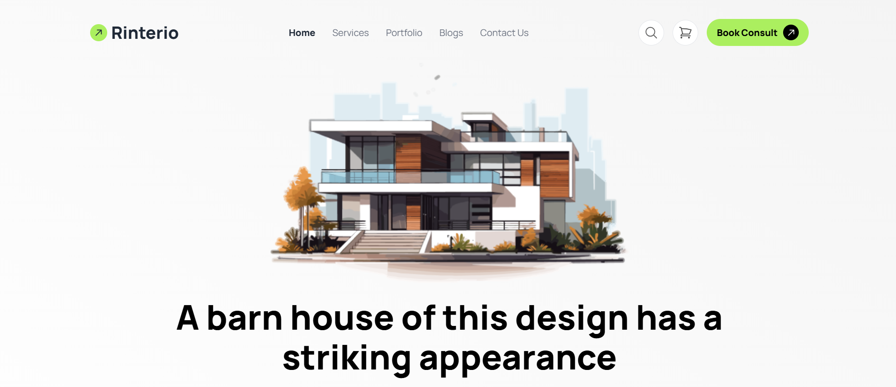

# Peddy - Pet Adoption Platform
A cutting-edge, responsive pet adoption platform leveraging Tailwind CSS, ES6+ JavaScript, and real-time API integration to deliver an intuitive and engaging user experience.
### Source Code: [Peddy](https://github.com/khh-Niloy/ph-projects/tree/main/peddy) | Live demo: [Peddy](https://peddy-a5.netlify.app/)

# Rinterio – Interior Design Solutions
Crafting modern, functional spaces with a responsive design powered by Tailwind CSS and intuitive web technologies for a seamless user experience.
### Source Code: [Rinterio](https://github.com/khh-Niloy/ph-projects/tree/main/rinterio) | Live demo: [Rinterio](https://rinterio-a3.netlify.app/)

