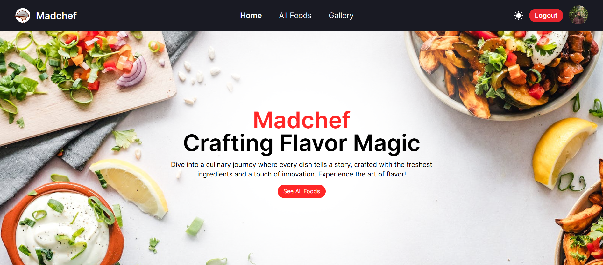

# FastPathao - Efficient Parcel Management
FastPathao is a full-stack parcel management system built with **React.js**, **Firebase Authentication**, **Tailwind CSS**, **Context API**, and **JWT** for secure authentication, managed via **local storage**. The backend, powered by **Express.js**, **MongoDB**, and **CORS Middleware**, ensures secure API requests and verification.

It features **three role-based dashboards**: **users** can create, track, and manage parcel deliveries, **admins** oversee the system by managing users and deliveries, while **delivery man** can view assigned parcels, update statuses, and ensure timely handling.
## Live site: [FastPathao](https://parceltracker-7e596.web.app/) | Source Code: [FastPathao](https://github.com/khh-Niloy/ph-projects/tree/main/ParcelTracker-A12)

# MadChef - Crafting Flavor Magic
A Full-Stack Restaurant Management Platform Built with **React.js**, **React Router**, **Firebase Authentication**, **Tailwind CSS**, **Context API**, and **JWT** (storing and sending tokens) and a Fully **Responsive** Design. Powered by **Express.js**, **MongoDB**, **JWT** (used for token verification on the backend), and **CORS** Middleware.
## Live site: [MadChef](https://madchef-1487d.web.app/) | Source Code: [MadChef](https://github.com/khh-Niloy/ph-projects/tree/main/Madchef-A11)

# EquiSports – Redefining Sports Management
A Comprehensive Sports Management Platform Built with **React**, **React Router**, **Firebase**, **Tailwind CSS**, **Context API**, and **NPM Packages** on the Client Side, Offering Secure Authentication, Dynamic Features, and a Fully **Responsive** Design. Powered by **Express.js**, **Middleware (CORS)**, and **MongoDB** on the Server Side, Deployed to Vercel for Seamless Performance Across All Devices.
## Live site: [EquiSports](https://reliable-beijinho-b77bf7.netlify.app/) | Source Code: [EquiSports](https://github.com/khh-Niloy/ph-projects/tree/main/EquiSports-A10)

# NextStep – Empowering Your Career Journey
A Modern Career Counseling Platform Built with **React**, **React Router**, **Firebase**, and **NPM Packages**, Offering Secure **Authentication**, Dynamic Features, and a Fully **Responsive** Design for an Intuitive User Experience Across All Devices.
## Live site: [NextStep](https://thriving-starlight-762625.netlify.app/) | Source Code: [NextStep](https://github.com/khh-Niloy/ph-projects/tree/main/Next%20Step)

# Gadget Heaven – Tech at Your Fingertips
A Sleek, Responsive Web App Built with **React**, **Context API** for Effortless State Management, and **React Router** for Fluid Navigation—Optimized for a Seamless, Modern User Experience.
## Live site: [Gadget Heaven](https://imaginative-semolina-e3f9d0.netlify.app/) | Source Code: [Gadget Heaven](https://github.com/khh-Niloy/ph-projects/tree/main/Gadget%20Heaven)

# Peddy - Pet Adoption Platform
A cutting-edge, responsive pet adoption platform leveraging **Tailwind CSS**, **ES6+ JavaScript**, and real-time **API integration** to deliver an intuitive and engaging user experience.
## Live site: [Peddy](https://peddy-a5.netlify.app/) | Source Code: [Peddy](https://github.com/khh-Niloy/ph-projects/tree/main/peddy)

# Rinterio – Interior Design Solutions
Crafting modern, functional spaces with a responsive design powered by **Tailwind CSS** and intuitive web technologies for a seamless user experience.
## Live site: [Rinterio](https://rinterio-a3.netlify.app/) | Source Code: [Rinterio](https://github.com/khh-Niloy/ph-projects/tree/main/rinterio)

