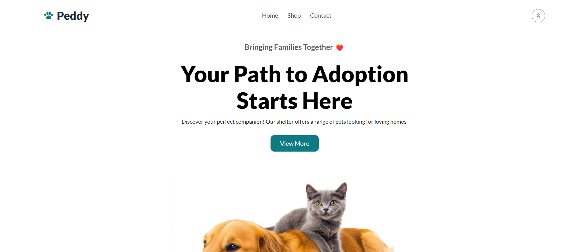

# Peddy - Pet Adoption Platform

Peddy is a dynamic and responsive pet adoption platform that allows users to browse and adopt their favorite pets. The platform fetches real-time pet data from an API and offers users a seamless experience with a clean interface and easy-to-use features.
# Live Demo - [Netlify](https://peddy-a5.netlify.app/)


## Key Features
1. **Responsive Navbar**: A sleek and fully responsive navigation bar
2. **Dynamic Pet Display**: Pets are fetched and displayed dynamically with real-time API integration.
3. **Sort by Price**: Users can sort pets by their adoption price for easier browsing.
4. **Loading Spinner**: Displays a loading spinner for 2 seconds while fetching pet data, ensuring smooth user experience.
5. **Modal Details**: Pet details are shown in a modal window for a clean, non-intrusive display.

## Technologies Used:

- **Tailwind CSS**: A utility-first CSS framework for building responsive, custom designs.
- **ES6+ JavaScript**: Modern JavaScript features like arrow functions, promises, and async/await for a cleaner and more efficient codebase.
- **Real-time API Integration**: Fetching and updating pet data dynamically for a seamless user experience.

## Local Setup

To run this project locally, follow these steps:

1. **Clone the repository:**
    ```bash
    git clone https://github.com/your-username/peddy.git
    ```

2. **Navigate to the project directory:**
    ```bash
    cd peddy
    ```

3. **Install Tailwind CSS:**
    If you're using a local build, ensure that you have `Node.js` installed, then run:
    ```bash
    npm install -D tailwindcss
    ```

    If you don't want to set up Tailwind locally, you can also use the CDN version by adding this to your HTML:
    ```html
    <link href="https://cdn.tailwindcss.com" rel="stylesheet">
    ```

4. **Build Tailwind (if you're using the local setup):**
    If you're using a build setup, run the following command to compile Tailwind CSS:
    ```bash
    npx tailwindcss -i ./src/input.css -o ./dist/output.css --watch
    ```

5. **Open the project in your browser:**
    After setting up, open the `index.html` file in your browser to view the project.

Ensure that you replace `your-username/peddy.git` with your actual GitHub username and repository name.
